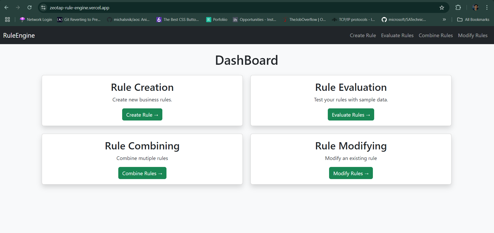
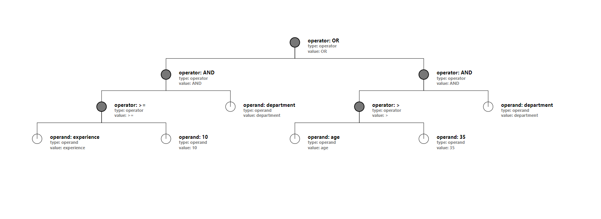

# Rule Engine with AST





## Objective:

Develop a simple 3-tier rule engine application(Simple UI, API and Backend, Data) to determine
user eligibility based on attributes like age, department, income, spend etc. The system can use
Abstract Syntax Tree (AST) to represent conditional rules and allow for dynamic creation,combination, and modification of these rules.

## Workflow Video:
https://github.com/user-attachments/assets/f40fa51b-4ff8-4a0a-9cf9-072385c008b5

## Live Link:

https://zeotap-rule-engine.vercel.app/

## Working with the repository (locally):

1. Fork and clone the repo using GitHub Desktop or CLI

```bash
    git clone https://zeotap-rule-engine.vercel.app/
```

2. Install the required dependencies

```bash
    cd client
    npm install axios bootstrap react react-d3-tree react-dom react-router-dom react-toastify @vitejs/plugin-react vite --save
```

```bash
    cd server
    npm install cors dotenv express express-rate-limit helmet mongoose nodemon --save-dev
```

3. Run the client and server separately with the command:

```bash
    npm run dev
```

## Deployed on:

1. Frontend: **Vercel**
2. Backend: **Render**

## Project Maintainer:

`Rajnish Kumar Singh`
