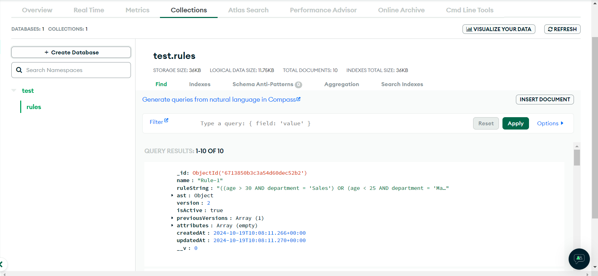

# Rule Engine with AST

## Objective:

Develop a simple 3-tier rule engine application(Simple UI, API and Backend, Data) to determine
user eligibility based on attributes like age, department, income, spend etc. The system can use
Abstract Syntax Tree (AST) to represent conditional rules and allow for dynamic creation,combination, and modification of these rules.




## Major Functionalities:

1. **create_rule**: Takes a string representing a rule and returns a Node object representing the corresponding AST. The rules are stored in the MongoDB Atlas database.

2. **combine_rules**: Takes a list of rule strings and combines them
   into a single AST.

3. **evaluate_rule(JSON data)**: Takes a JSON representing the combined
   rule's AST and a dictionary data containing attributes (e.g., data = {"age": 35,
   "department": "Sales", "salary": 60000, "experience": 3}). The
   function should evaluate the rule against the provided data and return True if the user is of that cohort based on the rule, False otherwise.

4. **modify_rule**: Allow for modification of existing rules using additional functionalities. This involves changing operators, operand values, or adding/removing sub-expressions within the AST.

## Workflow Video:

https://github.com/user-attachments/assets/f40fa51b-4ff8-4a0a-9cf9-072385c008b5

## Live Link:

https://zeotap-rule-engine.vercel.app/

## Working with the repository (locally):

1. Fork and clone the repo using GitHub Desktop or CLI

```bash
    git clone https://github.com/rks-031/rule-engine.git
```

2. Install the required dependencies

```bash
    cd client
    npm install axios bootstrap react react-d3-tree react-dom react-router-dom react-toastify @vitejs/plugin-react vite --save
```

```bash
    cd server
    npm install cors dotenv express express-rate-limit helmet mongoose nodemon --save-dev
```

3. Run the client and server separately with the command:

```bash
    npm run dev
```

## Deployed on:

1. Frontend: **Vercel**
2. Backend: **Render**

## Project Maintainer:

`Rajnish Kumar Singh`
